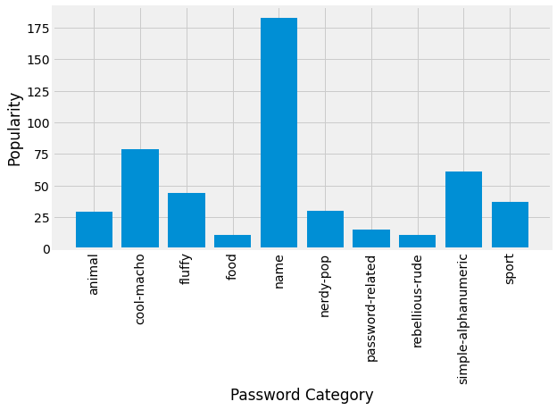
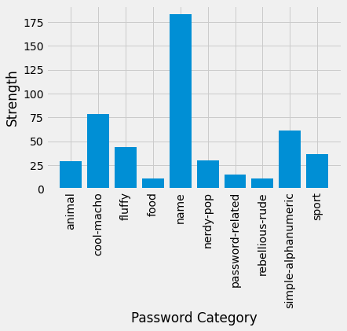
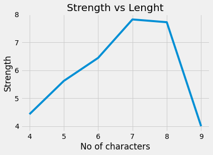

# Importing Libraries
### (even those I have no idea that I would use them or not 😅)


```python
import numpy as np
import pandas as pd
import matplotlib.pyplot as plt
```

# Reading dataset from the link given

#### About Dataset
This week's data is all about passwords. Data is sourced from [Information is Beautiful.](https://docs.google.com/spreadsheets/d/1cz7TDhm0ebVpySqbTvrHrD3WpxeyE4hLZtifWSnoNTQ/edit#gid=21)
There's lots of additional information about password quality & strength in the source [Doc](https://docs.google.com/spreadsheets/d/1cz7TDhm0ebVpySqbTvrHrD3WpxeyE4hLZtifWSnoNTQ/edit#gid=21). Please note that the "strength" column in this dataset is relative to these common aka "bad" passwords and YOU SHOULDN'T USE ANY OF THEM!


|variable          |class     |description |
|:-----------------|:---------|:-----------|
|rank              |double    | popularity in their database of released passwords |
|password          |character | Actual text of the password |
|category          |character | What category does the password fall in to?|
|value             |double    | Time to crack by online guessing |
|time_unit         |character | Time unit to match with value |
|offline_crack_sec |double    | Time to crack offline in seconds |
|rank_alt          |double    | Rank 2 |
|strength          |double    | Strength = quality of password where 10 is highest, 1 is lowest, please note that these are relative to these generally bad passwords |
|font_size         |double    | Used to create the graphic for KIB |

# Reading the dataset and looking at the tail (oh that's your first time not seeing head after reading dataset)

#### There are some null values so we need to trim the rows.


```python
df = pd.read_csv('https://raw.githubusercontent.com/rfordatascience/tidytuesday/master/data/2020/2020-01-14/passwords.csv')
df.tail(8)
```


<table border="1" class="dataframe">
  <thead>
    <tr style="text-align: right;">
      <th></th>
      <th>rank</th>
      <th>password</th>
      <th>category</th>
      <th>value</th>
      <th>time_unit</th>
      <th>offline_crack_sec</th>
      <th>rank_alt</th>
      <th>strength</th>
      <th>font_size</th>
    </tr>
  </thead>
  <tbody>
    <tr>
      <th>499</th>
      <td>500.0</td>
      <td>passw0rd</td>
      <td>password-related</td>
      <td>92.27</td>
      <td>years</td>
      <td>29.02</td>
      <td>502.0</td>
      <td>28.0</td>
      <td>21.0</td>
    </tr>
    <tr>
      <th>500</th>
      <td>NaN</td>
      <td>NaN</td>
      <td>NaN</td>
      <td>NaN</td>
      <td>NaN</td>
      <td>NaN</td>
      <td>NaN</td>
      <td>NaN</td>
      <td>NaN</td>
    </tr>
    <tr>
      <th>501</th>
      <td>NaN</td>
      <td>NaN</td>
      <td>NaN</td>
      <td>NaN</td>
      <td>NaN</td>
      <td>NaN</td>
      <td>NaN</td>
      <td>NaN</td>
      <td>NaN</td>
    </tr>
    <tr>
      <th>502</th>
      <td>NaN</td>
      <td>NaN</td>
      <td>NaN</td>
      <td>NaN</td>
      <td>NaN</td>
      <td>NaN</td>
      <td>NaN</td>
      <td>NaN</td>
      <td>NaN</td>
    </tr>
    <tr>
      <th>503</th>
      <td>NaN</td>
      <td>NaN</td>
      <td>NaN</td>
      <td>NaN</td>
      <td>NaN</td>
      <td>NaN</td>
      <td>NaN</td>
      <td>NaN</td>
      <td>NaN</td>
    </tr>
    <tr>
      <th>504</th>
      <td>NaN</td>
      <td>NaN</td>
      <td>NaN</td>
      <td>NaN</td>
      <td>NaN</td>
      <td>NaN</td>
      <td>NaN</td>
      <td>NaN</td>
      <td>NaN</td>
    </tr>
    <tr>
      <th>505</th>
      <td>NaN</td>
      <td>NaN</td>
      <td>NaN</td>
      <td>NaN</td>
      <td>NaN</td>
      <td>NaN</td>
      <td>NaN</td>
      <td>NaN</td>
      <td>NaN</td>
    </tr>
    <tr>
      <th>506</th>
      <td>NaN</td>
      <td>NaN</td>
      <td>NaN</td>
      <td>NaN</td>
      <td>NaN</td>
      <td>NaN</td>
      <td>NaN</td>
      <td>NaN</td>
      <td>NaN</td>
    </tr>
  </tbody>
</table>
</div>


```python
df = df.iloc[:-7]
df.tail(8)
```

</style>
<table border="1" class="dataframe">
  <thead>
    <tr style="text-align: right;">
      <th></th>
      <th>rank</th>
      <th>password</th>
      <th>category</th>
      <th>value</th>
      <th>time_unit</th>
      <th>offline_crack_sec</th>
      <th>rank_alt</th>
      <th>strength</th>
      <th>font_size</th>
    </tr>
  </thead>
  <tbody>
    <tr>
      <th>492</th>
      <td>493.0</td>
      <td>chance</td>
      <td>name</td>
      <td>3.72</td>
      <td>days</td>
      <td>0.00321</td>
      <td>495.0</td>
      <td>7.0</td>
      <td>11.0</td>
    </tr>
    <tr>
      <th>493</th>
      <td>494.0</td>
      <td>genesis</td>
      <td>nerdy-pop</td>
      <td>3.19</td>
      <td>months</td>
      <td>0.08350</td>
      <td>496.0</td>
      <td>7.0</td>
      <td>11.0</td>
    </tr>
    <tr>
      <th>494</th>
      <td>495.0</td>
      <td>hotrod</td>
      <td>cool-macho</td>
      <td>3.72</td>
      <td>days</td>
      <td>0.00321</td>
      <td>497.0</td>
      <td>7.0</td>
      <td>11.0</td>
    </tr>
    <tr>
      <th>495</th>
      <td>496.0</td>
      <td>reddog</td>
      <td>cool-macho</td>
      <td>3.72</td>
      <td>days</td>
      <td>0.00321</td>
      <td>498.0</td>
      <td>6.0</td>
      <td>10.0</td>
    </tr>
    <tr>
      <th>496</th>
      <td>497.0</td>
      <td>alexande</td>
      <td>name</td>
      <td>6.91</td>
      <td>years</td>
      <td>2.17000</td>
      <td>499.0</td>
      <td>9.0</td>
      <td>12.0</td>
    </tr>
    <tr>
      <th>497</th>
      <td>498.0</td>
      <td>college</td>
      <td>nerdy-pop</td>
      <td>3.19</td>
      <td>months</td>
      <td>0.08350</td>
      <td>500.0</td>
      <td>7.0</td>
      <td>11.0</td>
    </tr>
    <tr>
      <th>498</th>
      <td>499.0</td>
      <td>jester</td>
      <td>name</td>
      <td>3.72</td>
      <td>days</td>
      <td>0.00321</td>
      <td>501.0</td>
      <td>7.0</td>
      <td>11.0</td>
    </tr>
    <tr>
      <th>499</th>
      <td>500.0</td>
      <td>passw0rd</td>
      <td>password-related</td>
      <td>92.27</td>
      <td>years</td>
      <td>29.02000</td>
      <td>502.0</td>
      <td>28.0</td>
      <td>21.0</td>
    </tr>
  </tbody>
</table>
</div>


# Plotting the famous categories and their popularity


```python
famous_category = df.groupby('category')['category'].count()

# setting a larger plot size
plt.figure(figsize=(10,5))
# using a different style
plt.style.use("fivethirtyeight")
# plotting chart
plt.bar(famous_category.index,famous_category.values)
# rotating the x labels because they are loooooong
plt.xticks(rotation=90)
# setting the title so that peasents can know what's going on
plt.xlabel("Password Category")
# same as above
plt.ylabel("Popularity")
# atually displaying the chart
plt.show()
```





# Now ploting which category has the most strength.

###### But before that


```python
# th 14 in the nerdy-pop mean indicates that there are some values more than 10 which is not right.
df.groupby('category')['strength'].mean()
```


    category
    animal                  7.551724
    cool-macho              7.215190
    fluffy                  6.772727
    food                    4.363636
    name                    7.191257
    nerdy-pop              14.000000
    password-related        7.866667
    rebellious-rude         6.727273
    simple-alphanumeric     5.852459
    sport                   8.000000
    Name: strength, dtype: float64


```python
# Now displaying how many rows does have strength more than 10
df[df['strength']>10]
```


</style>
<table border="1" class="dataframe">
  <thead>
    <tr style="text-align: right;">
      <th></th>
      <th>rank</th>
      <th>password</th>
      <th>category</th>
      <th>value</th>
      <th>time_unit</th>
      <th>offline_crack_sec</th>
      <th>rank_alt</th>
      <th>strength</th>
      <th>font_size</th>
    </tr>
  </thead>
  <tbody>
    <tr>
      <th>12</th>
      <td>13.0</td>
      <td>abc123</td>
      <td>simple-alphanumeric</td>
      <td>3.70</td>
      <td>weeks</td>
      <td>0.022400</td>
      <td>13.0</td>
      <td>32.0</td>
      <td>23.0</td>
    </tr>
    <tr>
      <th>25</th>
      <td>26.0</td>
      <td>trustno1</td>
      <td>simple-alphanumeric</td>
      <td>92.27</td>
      <td>years</td>
      <td>29.020000</td>
      <td>26.0</td>
      <td>25.0</td>
      <td>20.0</td>
    </tr>
    <tr>
      <th>148</th>
      <td>149.0</td>
      <td>ncc1701</td>
      <td>nerdy-pop</td>
      <td>2.56</td>
      <td>years</td>
      <td>0.806000</td>
      <td>149.0</td>
      <td>46.0</td>
      <td>27.0</td>
    </tr>
    <tr>
      <th>196</th>
      <td>197.0</td>
      <td>thx1138</td>
      <td>nerdy-pop</td>
      <td>2.56</td>
      <td>years</td>
      <td>0.806000</td>
      <td>198.0</td>
      <td>46.0</td>
      <td>27.0</td>
    </tr>
    <tr>
      <th>273</th>
      <td>274.0</td>
      <td>8675309</td>
      <td>nerdy-pop</td>
      <td>3.09</td>
      <td>hours</td>
      <td>0.000111</td>
      <td>275.0</td>
      <td>19.0</td>
      <td>17.0</td>
    </tr>
    <tr>
      <th>320</th>
      <td>321.0</td>
      <td>bond007</td>
      <td>nerdy-pop</td>
      <td>2.56</td>
      <td>years</td>
      <td>0.806000</td>
      <td>322.0</td>
      <td>38.0</td>
      <td>25.0</td>
    </tr>
    <tr>
      <th>335</th>
      <td>336.0</td>
      <td>rush2112</td>
      <td>nerdy-pop</td>
      <td>92.27</td>
      <td>years</td>
      <td>29.020000</td>
      <td>337.0</td>
      <td>48.0</td>
      <td>28.0</td>
    </tr>
    <tr>
      <th>343</th>
      <td>344.0</td>
      <td>red123</td>
      <td>simple-alphanumeric</td>
      <td>3.70</td>
      <td>weeks</td>
      <td>0.022400</td>
      <td>345.0</td>
      <td>35.0</td>
      <td>24.0</td>
    </tr>
    <tr>
      <th>358</th>
      <td>359.0</td>
      <td>ou812</td>
      <td>nerdy-pop</td>
      <td>17.28</td>
      <td>hours</td>
      <td>0.000622</td>
      <td>360.0</td>
      <td>36.0</td>
      <td>24.0</td>
    </tr>
    <tr>
      <th>394</th>
      <td>395.0</td>
      <td>heka6w2</td>
      <td>simple-alphanumeric</td>
      <td>2.56</td>
      <td>years</td>
      <td>0.806000</td>
      <td>396.0</td>
      <td>36.0</td>
      <td>24.0</td>
    </tr>
    <tr>
      <th>405</th>
      <td>406.0</td>
      <td>jordan23</td>
      <td>sport</td>
      <td>92.27</td>
      <td>years</td>
      <td>29.270000</td>
      <td>407.0</td>
      <td>34.0</td>
      <td>23.0</td>
    </tr>
    <tr>
      <th>406</th>
      <td>407.0</td>
      <td>eagle1</td>
      <td>simple-alphanumeric</td>
      <td>3.70</td>
      <td>weeks</td>
      <td>0.022400</td>
      <td>408.0</td>
      <td>21.0</td>
      <td>18.0</td>
    </tr>
    <tr>
      <th>462</th>
      <td>463.0</td>
      <td>123abc</td>
      <td>simple-alphanumeric</td>
      <td>3.70</td>
      <td>weeks</td>
      <td>0.022400</td>
      <td>465.0</td>
      <td>32.0</td>
      <td>23.0</td>
    </tr>
    <tr>
      <th>477</th>
      <td>478.0</td>
      <td>test123</td>
      <td>simple-alphanumeric</td>
      <td>2.56</td>
      <td>years</td>
      <td>0.806000</td>
      <td>480.0</td>
      <td>36.0</td>
      <td>24.0</td>
    </tr>
    <tr>
      <th>499</th>
      <td>500.0</td>
      <td>passw0rd</td>
      <td>password-related</td>
      <td>92.27</td>
      <td>years</td>
      <td>29.020000</td>
      <td>502.0</td>
      <td>28.0</td>
      <td>21.0</td>
    </tr>
  </tbody>
</table>
</div>


#### We can just easily remove them because thye are just 15. Every output being smaller than 10 shows that we have removed the outliers


```python
df = df[df['strength'] <= 10]
df.groupby(['category'])['strength'].mean()
```


    category
    animal                 7.551724
    cool-macho             7.215190
    fluffy                 6.772727
    food                   4.363636
    name                   7.191257
    nerdy-pop              7.791667
    password-related       6.428571
    rebellious-rude        6.727273
    simple-alphanumeric    2.592593
    sport                  7.277778
    Name: strength, dtype: float64


```python
# removing columns that won't be helpful
df.drop(columns = ['rank_alt','font_size'],inplace=True)
```

# Which category has the most strength


```python
string_category_category = df.groupby('category')['strength'].mean()
# plotting chart
plt.bar(famous_category.index,famous_category.values)
# rotating the x labels because they are loooooong
plt.xticks(rotation=90)
# setting the title so that peasents can know what's going on
plt.xlabel("Password Category")
# same as above
plt.ylabel("Strength")
# atually displaying the chart
plt.show()
```





### Does only the passwords **length** makes a stronge password? 


```python
df['chars'] = df['password'].apply(lambda x:len(list(x)))

chars_stren = df.groupby('chars')['strength'].mean()
plt.plot(chars_stren.index, chars_stren.values)
plt.xlabel("No of characters")
plt.ylabel("Strength")
plt.title("Strength vs Lenght")
plt.show()
```





### Probably not. What what password has a length of 9 but strength of almost 0??


```python
df[df['chars'] == 9]
```


<table border="1" class="dataframe">
  <thead>
    <tr style="text-align: right;">
      <th></th>
      <th>rank</th>
      <th>password</th>
      <th>category</th>
      <th>value</th>
      <th>time_unit</th>
      <th>offline_crack_sec</th>
      <th>strength</th>
      <th>chars</th>
    </tr>
  </thead>
  <tbody>
    <tr>
      <th>48</th>
      <td>49.0</td>
      <td>123456789</td>
      <td>simple-alphanumeric</td>
      <td>1.84</td>
      <td>weeks</td>
      <td>0.0111</td>
      <td>4.0</td>
      <td>9</td>
    </tr>
  </tbody>
</table>
</div>


