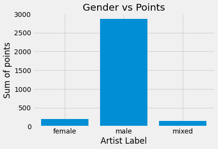
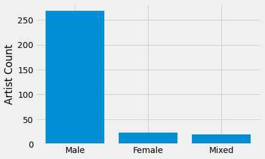
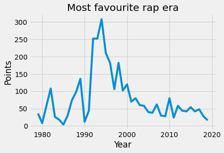
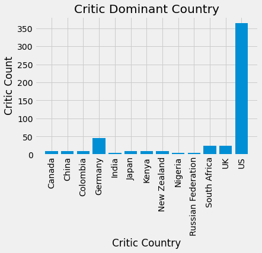
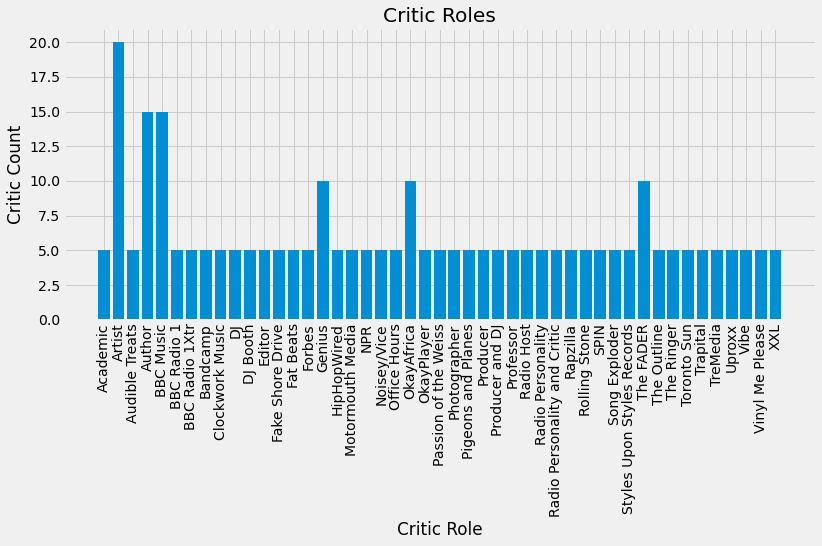
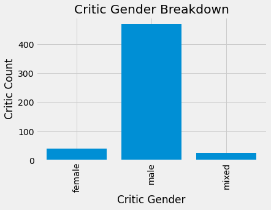

# Analyzing-Rap-Dataset
Visualizing Rap Songs Dataset and getting some insights.


# Rap Artists

The data this week comes from [BBC Music](http://www.bbc.com/culture/story/20191007-the-greatest-hip-hop-songs-of-all-time-who-voted) by way of [Simon Jockers at Datawrapper](https://blog.datawrapper.de/best-hip-hop-songs-of-all-time-visualized/).

The raw data can be found on his [Github](https://github.com/sjockers/bbc-best-rapmusic). Album covers were retrived from Spotify, and you can access them via the Spotify API.

> Earlier this year, BBC Music asked more than 100 critics, artists, and other music industry folks from 15 countries for their five favorite hip-hop tracks. Then they broke down the results of the poll into one definitive list. But BBC Music didn’t just publish a best-of list, they also published the complete poll results and a description of the simple algorithm they ranked the songs with. - Simon Jockers

> We awarded 10 points for first ranked track, eight points for second ranked track, and so on down to two points for fifth place. The song with the most points won. We split ties by the total number of votes: songs with more votes ranked higher. Any ties remaining after this were split by first place votes, followed by second place votes and so on: songs with more critics placing them at higher up the lists up ranked higher. -- BBC Music

### Data Dictionary

# `polls.csv`

|variable        |class     |description |
|:---------------|:---------|:-----------|
|rank            |double    | Rank given by voter (1-5) |
|title           |character | Title of song|
|artist          |character | Artist |
|gender          |character | Gender of artist |
|year            |double    | Year song released |
|critic_name     |character | Name of critic|
|critic_rols     |character | Critic's role |
|critic_country  |character | Critic's primary country|
|critic_country2 |character | Critic's secondary country |

# `rankings.csv`

|variable |class     |description |
|:--------|:---------|:-----------|
|ID       |double    |ID of song |
|title    |character | Title of song  |
|artist   |character | Artist's name |
|year     |double    | Year song released |
|gender   |character | Gender of artist/group |
|points   |double    | Total points awarded |
|n        |double    |Total votes (regardless of position) |
|n1       |double    | Number of votes as #1 |
|n2       |double    |Number of votes as #2 |
|n3       |double    |Number of votes as #3 |
|n4       |double    |Number of votes as #4 |
|n5       |double    |Number of votes as #5 |

## The mandatory first step to import these 3 libraries whether or not you are planning to use them or not


```python
import pandas as pd
import numpy as np
import matplotlib.pyplot as plt

polls = pd.read_csv('https://raw.githubusercontent.com/rfordatascience/tidytuesday/master/data/2020/2020-04-14/polls.csv')
ranking = pd.read_csv('https://raw.githubusercontent.com/rfordatascience/tidytuesday/master/data/2020/2020-04-14/rankings.csv')
```

## Working with ranking.csv file
### Finding favourite artist gender


```python
plt.style.use("fivethirtyeight")

gender = ranking.groupby(['gender'])['points'].sum().index.to_list()
points = ranking.groupby(['gender'])['points'].sum().values
plt.bar(gender,points)
plt.xlabel('Artist Label')
plt.ylabel('Sum of points')
plt.title('Gender vs Points')
plt.show()
```





### Gender wise distribution of artist


```python
female_artists = ranking[ranking['gender'] == 'female']['ID'].count()
male_artists = ranking[ranking['gender'] == 'male']['ID'].count()
mixed_artists = ranking[ranking['gender'] == 'mixed']['ID'].count()

plt.bar(['Male','Female','Mixed'],[male_artists,female_artists,mixed_artists])
plt.ylabel('Artist Count')
plt.show()
```





### Which song was in the top spot of most people?


```python
top_fav_songs = ranking.sort_values('n1',ascending=False)
top_fav_songs[['title','artist','year']].head(3)
```

<table border="1" class="dataframe">
  <thead>
    <tr style="text-align: right;">
      <th></th>
      <th>title</th>
      <th>artist</th>
      <th>year</th>
    </tr>
  </thead>
  <tbody>
    <tr>
      <th>0</th>
      <td>Juicy</td>
      <td>The Notorious B.I.G.</td>
      <td>1994</td>
    </tr>
    <tr>
      <th>1</th>
      <td>Fight The Power</td>
      <td>Public Enemy</td>
      <td>1989</td>
    </tr>
    <tr>
      <th>3</th>
      <td>The Message</td>
      <td>Grandmaster Flash &amp; The Furious Five</td>
      <td>1982</td>
    </tr>
  </tbody>
</table>
</div>


# The year of the most favourite rap song


```python
years = ranking.groupby(['year'])['points'].sum().index.values
points = ranking.groupby(['year'])['points'].sum().values
year, point = [[x,y] for y, x in sorted(zip(points, years))][-1]
year
```


    1994


## Most frequent favourite artist of all times


```python
artists = ranking.groupby(['artist'])['points'].sum().index.values
points  = ranking.groupby(['artist'])['points'].sum().values
artist, point = [[x,y] for y, x in sorted(zip(points, artists))][-1]
print("Artist: {}".format(artist))
print("Points: {}".format(point))
```

    Artist: The Notorious B.I.G.
    Points: 162
    

## The most favourite rap era so far


```python
years = ranking.groupby(['year'])['points'].sum().index.values
points = ranking.groupby(['year'])['points'].sum().values
plt.plot(years, points)
plt.title("Most favourite rap era")
plt.xlabel('Year')
plt.ylabel('Points')
plt.show()
```





## The oldest *not so liked* song


```python
least_fav = ranking.groupby(['artist']).sum()
least_fav = least_fav[least_fav['points'] == least_fav.points.min()]
oldest_not_fav_ID = least_fav.sort_values(['points','year'])['ID'][0]
ranking[ranking['ID'] == oldest_not_fav_ID][['title','artist','year','points']]
```


<table border="1" class="dataframe">
  <thead>
    <tr style="text-align: right;">
      <th></th>
      <th>title</th>
      <th>artist</th>
      <th>year</th>
      <th>points</th>
    </tr>
  </thead>
  <tbody>
    <tr>
      <th>304</th>
      <td>The Breaks</td>
      <td>Kurtis Blow</td>
      <td>1980</td>
      <td>2</td>
    </tr>
  </tbody>
</table>
</div>


## The latest *not so liked* song


```python
least_fav = ranking.groupby(['artist']).sum()
least_fav = least_fav[least_fav['points'] == least_fav.points.min()]
latest_not_fav_ID = least_fav.sort_values(['points','year'])['ID'][-1]
ranking[ranking['ID'] == latest_not_fav_ID][['title','artist','year','points']]
```


<table border="1" class="dataframe">
  <thead>
    <tr style="text-align: right;">
      <th></th>
      <th>title</th>
      <th>artist</th>
      <th>year</th>
      <th>points</th>
    </tr>
  </thead>
  <tbody>
    <tr>
      <th>288</th>
      <td>Mtaktak</td>
      <td>Shabjdeed &amp; Al Nather</td>
      <td>2019</td>
      <td>2</td>
    </tr>
  </tbody>
</table>
</div>


# Working with polls.csv


```python
polls = polls[~polls.critic_country2.isna()]
polls.drop(columns = ['critic_country2'], inplace = True)
polls
```


<table border="1" class="dataframe">
  <thead>
    <tr style="text-align: right;">
      <th></th>
      <th>rank</th>
      <th>title</th>
      <th>artist</th>
      <th>gender</th>
      <th>year</th>
      <th>critic_name</th>
      <th>critic_rols</th>
      <th>critic_country</th>
    </tr>
  </thead>
  <tbody>
    <tr>
      <th>200</th>
      <td>1</td>
      <td>Brenda’s Got A Baby</td>
      <td>2Pac</td>
      <td>male</td>
      <td>1991</td>
      <td>Polla Garmiany</td>
      <td>Critic</td>
      <td>Germany</td>
    </tr>
    <tr>
      <th>201</th>
      <td>2</td>
      <td>U.N.I.T.Y.</td>
      <td>Queen Latifah</td>
      <td>female</td>
      <td>1993</td>
      <td>Polla Garmiany</td>
      <td>Critic</td>
      <td>Germany</td>
    </tr>
    <tr>
      <th>202</th>
      <td>3</td>
      <td>The Story Of OJ</td>
      <td>JAY-Z</td>
      <td>male</td>
      <td>2017</td>
      <td>Polla Garmiany</td>
      <td>Critic</td>
      <td>Germany</td>
    </tr>
    <tr>
      <th>203</th>
      <td>4</td>
      <td>Ms Jackson</td>
      <td>OutKast</td>
      <td>male</td>
      <td>2000</td>
      <td>Polla Garmiany</td>
      <td>Critic</td>
      <td>Germany</td>
    </tr>
    <tr>
      <th>204</th>
      <td>5</td>
      <td>It Was A Good Day</td>
      <td>Ice Cube</td>
      <td>male</td>
      <td>1992</td>
      <td>Polla Garmiany</td>
      <td>Critic</td>
      <td>Germany</td>
    </tr>
  </tbody>
</table>
</div>


## Which country has the most critics


```python
country_names = polls.groupby(['critic_country'])['rank'].count().index.values
critic_count = polls.groupby(['critic_country'])['rank'].count().values
plt.bar(country_names, critic_count)
plt.xticks(rotation = 90)
plt.title("Critic Dominant Country")
plt.xlabel("Critic Country")
plt.ylabel("Critic Count")
plt.show()
```





## Breakdown of critics roles. Note that I have specifically removed those critics whose role in the industry were of *critic*


```python
plt.figure(figsize=(12,5))

polls.critic_rols.unique()

polls2 = polls[polls['critic_rols'] != 'Critic']
critic_roles = polls2.groupby(['critic_rols'])['rank'].count().index.values
critic_count = polls2.groupby(['critic_rols'])['rank'].count().values
plt.bar(critic_roles, critic_count)
plt.xticks(rotation = 90)
plt.title("Critic Roles")
plt.xlabel("Critic Role")
plt.ylabel("Critic Count")
plt.show()
```





## Gender breakdown of critics


```python
critic_gender = polls.groupby(['gender'])['rank'].count().index.values
critic_count = polls.groupby(['gender'])['rank'].count().values
plt.bar(critic_gender, critic_count)
plt.xticks(rotation = 90)
plt.title("Critic Gender Breakdown")
plt.xlabel("Critic Gender")
plt.ylabel("Critic Count")
plt.show()
```





```python

```
