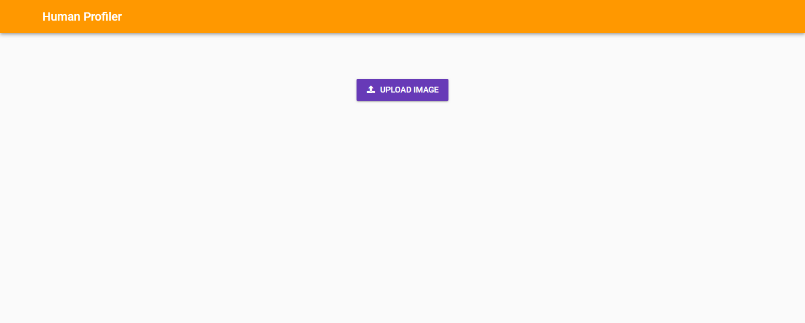
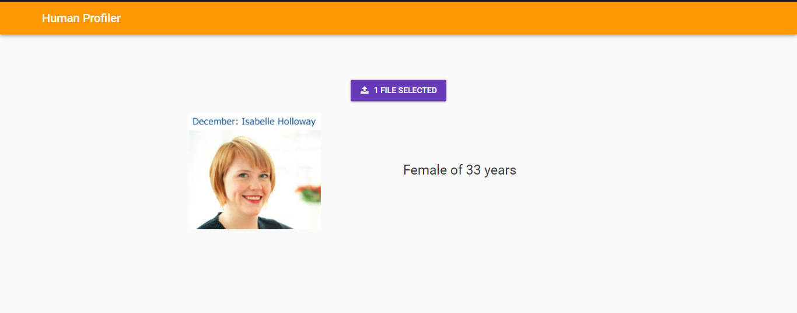

# Human Profiling

The main deep learning model and its working is available on my [FYP REPO](www.github.com/oelucifer/FYP]. Go check that out to know the insights. The web app is built using Anvil. The tutorial to build the app is available [here](https://anvil.works/learn/tutorials/jupyter-notebook-to-web-app)
> Its a simple web app that takes an image of a human being and shows its age and gender.

### Link

The webapp is live at [Human Profiler](https://humanprofiler.anvil.app/). The main Deep Learning model is deployed at Azure Server So I hope this webapp will be live forever(hope so!)


## The code:

### Importing libraries. I have used MTCNN for face detection.
```python
import cv2
import numpy as np
import anvil.media
import anvil.server
import anvil.server
import tensorflow as tf
from mtcnn import MTCNN

polls = pd.read_csv('https://raw.githubusercontent.com/rfordatascience/tidytuesday/master/data/2020/2020-04-14/polls.csv')
ranking = pd.read_csv('https://raw.githubusercontent.com/rfordatascience/tidytuesday/master/data/2020/2020-04-14/rankings.csv')
```

## Initialization and loading model
### The code is in python and doesn't require any changes.


```python
detector = MTCNN()
img_size = 64
model = tf.keras.models.load_model("drive/MyDrive/yu4u-age-gender.model")
anvil.server.connect('you-can-have-your-own-key-by-signing-in-on-anvil')
```

## Main function
> This function is set as callable so that it can be called from the anvil web app and the parameter file is the type of anvil media

```python
@anvil.server.callable
def profile_image(file):
  with anvil.media.TempFile(file) as filename:
    img = cv2.imread(filename)
  input_img = cv2.cvtColor(img, cv2.COLOR_BGR2RGB)
  img_h, img_w, _ = np.shape(input_img)

  faces = detector.detect_faces(img)

  all_labels = [];

  margin = 0.2
  for face in faces:
      bounding_box = face['box']
      if face['confidence']>.90: 
          x1, y1, x2, y2, w, h =  bounding_box[0], bounding_box[1],bounding_box[0]+bounding_box[2], bounding_box[1] + bounding_box[3],bounding_box[2],bounding_box[3]
          xw1 = max(int(x1 - margin * w), 0)
          yw1 = max(int(y1 - margin * h), 0)
          xw2 = min(int(x2 + margin * w), img_w - 1)
          yw2 = min(int(y2 + margin * h), img_h - 1)

          face_boundary = cv2.resize(img[yw1:yw2+1, xw1:xw2+1],(img_size,img_size)).reshape(-1,64,64,3)

          # predict ages and genders of the detected faces
          results = model.predict(face_boundary)
          predicted_genders = results[0]
          ages = np.arange(0, 101).reshape(101, 1)
          predicted_ages = results[1].dot(ages).flatten()

          pred_gender = "Male" if predicted_genders[0][0] < 0.5 else "Female"
          label_str = "{} of {} years".format(pred_gender,int(predicted_ages[0]))
          all_labels.append(label_str)
          
  return all_labels
```


>> Thats it for the code.


## The webapp

### The main page.


### The result.



